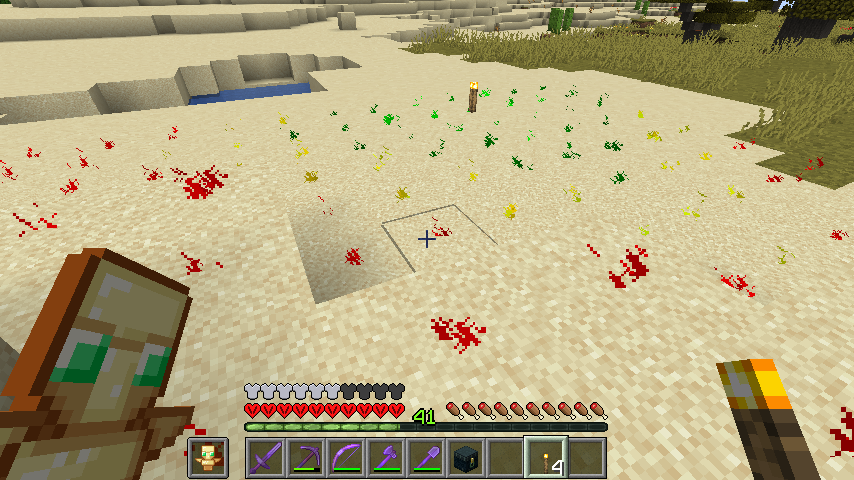

# Bukkit Light Level

Minecraft [Bukkit](https://bukkit.org) server plugin for showing light levels on nearby blocks.
This can be very helpful for lighting up an area to prevent mobs from spawning. 
With this plugin a user simply has to sneak while holding a torch (or other light-emitting material) and particles
will appear on nearby blocks showing relative light levels. Red particles indicate a light level of 7 or below, and
such blocks are spawnable for most mob types.

## Installation

If you just want to run the plugin, simply download the latest plugin version from the [BukkitLightLevel](https://dev.bukkit.org/projects/bukkitlightlevel)
project on dev.bukkit.org and place it in your server's `plugins` directory.

## Building from source

Building requires Maven, installation of which will not be covered here. See the [Maven](http://maven.apache.org/) 
project for details on how to set that up.

Building the jar file:

```shell
$ mvn install
```

You should see output similar to:

```
[INFO] --- maven-install-plugin:2.4:install (default-install) @ light-level ---
[INFO] Installing D:\Share\Craig\Projects\Minecraft\bukkit-light-level\target\light-level-1.0-SNAPSHOT.jar to C:\Users\cpmcd\.m2\repository\org\kowboy\bukkit\light-level\1.0-SNAPSHOT\light-level-1.0-SNAPSHOT.jar
[INFO] Installing D:\Share\Craig\Projects\Minecraft\bukkit-light-level\pom.xml to C:\Users\cpmcd\.m2\repository\org\kowboy\bukkit\light-level\1.0-SNAPSHOT\light-level-1.0-SNAPSHOT.pom
```

Copy the jar file to your server `plugins` directory and restart your server.

## Usage

To enable the feature (it is off by default):

```/light-level on```

Make sure your player is holding a light-emitting object (such as a torch) and hold down the key to sneak/crouch. This 
is `shift` by default on Java Edition. You should now see particles displayed on the top of visible blocks within an 
8-block square radius from the player. It should look something like this:



To turn the feature off again:

```/light-level off```

